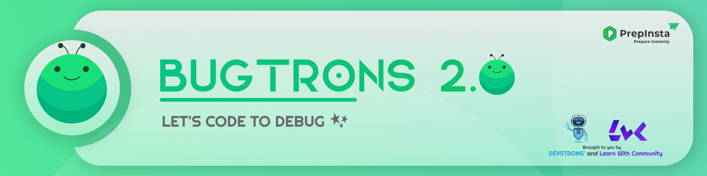

<!-- 
* - about
* - structure
* - participation guidelines
* - Code of conduct
* - Sponsors -->

  <h1 align="center">🐛 BUGTRONS 2.0</h1>

 

  <h3 align="center"> LET'S CODE TO DEBUG ✨ </h3>

    

 

## 🤖 ABOUT

The BUGTRONS 2.0, revamped version of [BUGTRONS](https://github.com/devstrons/bugtrons), is a student-run contest, organized with the collaboration of two tremendous tech-lead communities:-

- [DEVSTRONS'](https://devstrons.bio.link/): Student-run Open source/ project-based, inclusive & diverse community intending to Learn, Code and Tron (grow).

- [Learn With Community](https://learnwithcommunity.bio.link): A tech community, focusing on the best way to learn, learning together.

> "Competition makes us faster. Collaboration makes us better"

We aim to target community folks and make them aware of the Ed-tech industry by putting emphasis on problem-solving, code efficiency, code optimization, and logic-based programming.

We empower hackers to get influenced by developing software, enhancing skills, solving bugs & producing opportunities.

## ⚙ STRUCTURE

BUGRTONS 2.0 will be conducted in 3 phases.

This time, the contest is going to comprise both DSA and Debugging round for proper screening and evaluation. The participants would be judged on the basis of their Code submissions.

The respective contest rounds would be organized on the following platforms:

 |Round| Platform | Duration | Description |
 | --- | --- | --- | --- |
 | 1 |[Hackerrank](https://www.hackerrank.com/)| 3 hours | DSA round: This round which will mainly focus on easy and logic-based problems. |
 | 2 |[JetBrains IDE](https://replit.com/)| 2 hours | Debug Round: Participants have to debug and submit the provided program. |
 | 3 |[Hackerrank](https://www.hackerrank.com/)| 100 Min. | DSA round: This round consists of some medium and hard-level questions that can put your skills to the test. |

<!-- 
!Debug Round 1. Participants are to debug and submit the provided program
 -->

## ⚡ PARTICIPATION GUIDELINES

Rules and regulations help hackers understand what is expected of them & make sure to follow the [instructions](instructions.md) without violating them.

## 📰 CODE OF CONDUCT

Every participant is requested to abide by the [Code of Conduct](CODE_OF_CONDUCT.md). Failure to do so will result in immediate disqualification.

## 👕 PRIZE

All divisions will be judged simultaneously. The top 3 hackers will be awarded amazing prizes.

<!--

!- Sequel of BUGTRONS
!- In collaboration with LWC

!- About DEVSTRONS'
!- LWC

!- catchy quote (learning + putting the learnings to test)
!- Motive

-->
